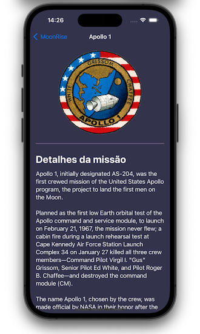

## Our Goal

To get more experience with Codable, but more importantly you’ll also work with scroll views, navigation, and much more interesting layouts..

## What I learn

- GeometryReader.
- AspectRatio(contentMode: .resize).
- Codable.
- JSON data.
- Basic debugging.

…and more.

#

> This is a project made from The [100DaysOfSwiftUI](https://www.hackingwithswift.com/100/swiftui), check my portfolio at [andreporto.vercel.app](https://andreporto.vercel.app)
